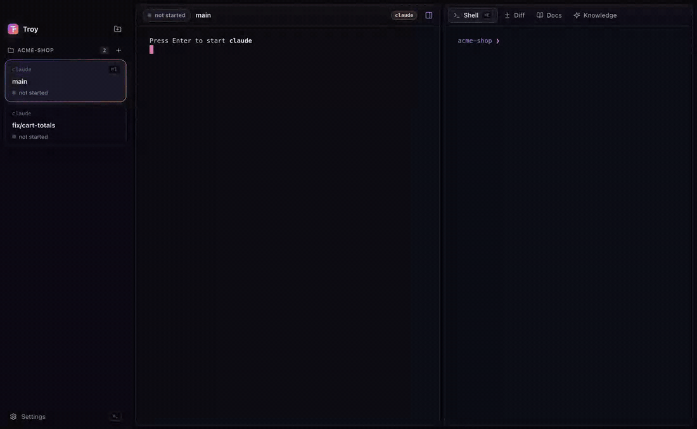

# Troy

Run coding agents (Claude Code, Codex, Gemini, …) side by side, each in its own git worktree, in a desktop app that never steals your terminal shortcuts.



> Early development. Today: add repos, create and archive worktrees, run an agent plus a shell in each, review the diff and ship it, see how full each agent's context window is, and share reviewed facts between agents.

## Install (macOS)

```bash
curl -fsSL https://raw.githubusercontent.com/m44abdel/troy/main/install.sh | sh
```

This downloads the latest release for your Mac (Apple Silicon or Intel) into `/Applications` and clears the quarantine flag. Troy is ad-hoc signed but not notarized, so this avoids the Gatekeeper prompt. Add `--dry-run` (`… | sh -s -- --dry-run`) to see every step without doing it. Re-running is safe: if that version is already installed, nothing changes. `uninstall.sh` removes exactly what the installer recorded and keeps your settings.

Other ways in:

- **Homebrew:** `brew install m44abdel/tap/troy`
- **DMG:** download it from [Releases](https://github.com/m44abdel/troy/releases). On first open, macOS blocks it; go to **System Settings → Privacy & Security** and click **Open Anyway**.

Troy doesn't bundle any agent: it runs whichever CLIs (claude, codex, gemini, …) are on your PATH.

## Worktrees

**⌘N** asks for a branch, a base branch (defaults to the remote's default branch), an agent CLI (Troy suggests the ones it finds on your PATH) and an optional first prompt. Troy fetches the base, runs `git worktree add` into a sibling directory `<repo>.<branch>`, then bootstraps it:

- copies untracked files matching the globs in `.troy/copy` (default `.env*`) from the main checkout
- gives each worktree its own `PORT_BASE` (3100, 3200, …) so dev servers don't collide
- runs `.troy/setup.sh` in the shell pane if the worktree has one (e.g. `npm i`)

The agent pane waits for Enter before starting, so setup can finish first. Each worktree is a card in the sidebar, titled with the first line of its initial prompt, with the agent's state underneath: working (output flowing), waiting (quiet or rang the bell), finished, or exited with an error. A session that starts waiting while you're looking at another one turns amber until you open it or click **Clear all waiting**.

Claude Code reports its own state through hooks Troy loads with `--settings`, merged with your settings and never written into the repo, so a long tool run reads as working and a permission prompt reads as waiting as soon as Claude asks. Other agents fall back to the output guess. When an agent starts waiting, finishes or fails while you're elsewhere, Troy sends a notification and counts waiting agents on the dock icon. A guessed wait never notifies.

When two worktrees of a repo change the same files, both cards say so (**⚠ Same files as feat-b (2)**; hover for the list), so you find the collision while the agents are still working, not at merge time. Changes count from where each worktree left its base: commits, uncommitted edits and new files.

Agents say the tests pass; Troy checks. Put any command in `.troy/check` (e.g. `npm test && npm run lint`) and Troy runs it whenever Claude Code reports it has stopped, and again before **Push** or **Open PR**. The card shows **✓ check** or **✗ check**, the diff tab shows the output, and **Send failure to agent** pastes it back to the agent. A result is reused until the worktree changes, so re-checking an unchanged tree is instant. Shipping with a failing check asks first.

## Context window

For Claude Code and Codex, Troy reads the agent's own session logs (`~/.claude/projects`, `~/.codex/sessions`; read-only, no API keys) and shows how full the context window is as a small ring on each worktree in the sidebar. It turns amber from 80%, and hovering shows tokens used, window size and model. Other CLIs show as unknown rather than a guess.

## Shared knowledge

Agents share what they learn through `.troy/knowledge.md`, a plain file in your main checkout that you commit like any other. Every entry is one fact plus its source (`path:line`, a commit hash or `session:<id>`), the date and who proposed it. Nothing gets in without you:

- Claude Code and Codex start with Troy's MCP server, `troy`, which has two tools. `knowledge_search` searches the approved facts. `knowledge_propose` adds a fact to a review queue, after checking that the cited file, line or commit really exists.
- The **Knowledge** tab shows the queue (its count appears on the tab) and the approved facts. Approving a fact appends it to `.troy/knowledge.md`.
- A fact is flagged **stale** once the file it cites has a commit after the fact's date.
- Each new worktree gets a short managed block in `CLAUDE.md` (Claude) or `AGENTS.md` (other agents, and whichever of the two already exists) pointing agents at the knowledge. Commit it once and later worktrees inherit it. Archiving removes the block again when it's the only change, so it never blocks `git worktree remove`.

Proposals wait in the repository's git directory (`.git/troy/proposals`), so they are shared by all worktrees and never committed.

## Docs

The **Docs** tab renders the worktree's markdown files (README first), including tables and ` ```mermaid ` diagrams. Relative links between docs open in the tab; web links open in your browser.

## Review and finish

The **Diff** tab (**⌘D**) shows everything the worktree changed since it branched off its base: commits, uncommitted edits and new files. Click a line number to leave a comment; **⌘Enter** pastes all comments into the agent as one message for you to send. The toolbar commits everything, pushes the branch, or opens its pull request in the browser via the [GitHub CLI](https://cli.github.com) (`gh`), creating one if it doesn't exist yet.

**⌘W** archives the worktree (`git worktree remove`, optionally deleting the branch). Git refuses if there are uncommitted changes, and the primary checkout can't be archived.

## Keyboard

App shortcuts use **⌘** on macOS (**Ctrl+Shift** on Linux/Windows). Every Ctrl and Alt chord goes straight to the terminal, so Ctrl-P, Ctrl-T, Ctrl-O, Alt-f and friends keep working inside your shell and agent.

| Shortcut | Action                            |
| -------- | --------------------------------- |
| ⌘O       | Add a repository                  |
| ⌘N       | New worktree                      |
| ⌘W       | Archive worktree                  |
| ⌘1–9     | Jump to worktree                  |
| ⌘[ / ⌘]  | Previous / next worktree          |
| ⌘J / ⌘E  | Focus agent / shell               |
| ⌘D       | Show the diff                     |
| ⌘Enter   | Send review comments to the agent |
| ⌘\\      | Toggle the right column           |
| ⌘,       | Settings                          |

Shortcuts live in `keybindings.json` in Troy's app data folder (**Settings → Open keybindings.json**). It maps key codes to actions, for example `"KeyK": "newWorktree"`; set a key to `null` to give it back to the terminal. Edits apply as soon as you save.

**Vim navigation** is off by default; turn it on in Settings. Then `j`/`k`, `gg`/`G` and `Enter` move through the sidebar, and `j`/`k`, `gg`/`G` and `]c`/`[c` scroll the diff and jump between hunks. These keys never apply while a terminal or text field has focus.

## Releasing

Bump `version` in `package.json`, then push a `v<version>` tag. GitHub Actions builds the arm64 and x64 DMG and zip and attaches them to a draft release; publish the draft for `install.sh` to pick it up. Then bump `version` in `packaging/troy.rb` and copy it to the `m44abdel/homebrew-tap` repo as `Casks/troy.rb`.

## Development

```bash
npm install
npm run dev        # run the app with hot reload
npm test           # unit tests
npm run test:e2e   # build, then drive the real app with Playwright
npm run build:mac  # package a .dmg
```

## License

[MIT](LICENSE)
